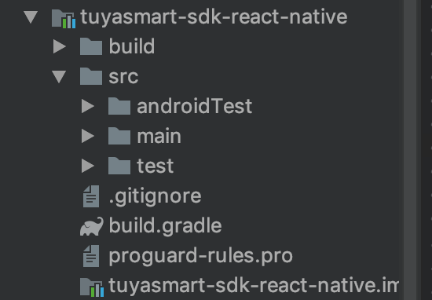

# tuyasmart-home-sdk-react-native


## Feature Overview

Tuya Smart APP SDK provides the interface package for the communication with hardware and Tuya Cloud to accelerate the application development process, including the following features:

Hardware functions (network configuration, control, status reporting, regular tasks, groups, firmware upgrades, sharing)
Account system (phone number, email registration, login, password reset and other general account functions)
Tuya Cloud HTTP API interface package

## Getting started
* （This has not been updated yet. Please refer to the following method）

`$ npm install tuyasmart-home-sdk --save`

`$ react-native link tuyasmart-home-sdk`

## Examples

See the demo in https://github.com/TuyaInc/tuyasmart-home-sdk-react-native/tree/master/Example before using.

## Doc

Refer to Details: [Tuya Smart Doc: tuyasmart-home-sdk-react-native](https://tuyakae.gitbook.io/tuyasmart-home-sdk-react-native)


## How to use - iOS
 
#### 1. Add the dependencies in the Podfile:
``` ruby
 platform :ios, '8.0'
 target 'Your_Project_Name' do
    pod "TuyaSmartHomeKit"
    pod 'React', :path => 'path/to/node_modules/react-native/', :subspecs => [
        'Core',
        'CxxBridge',
        'ART',
        'RCTActionSheet',
        'RCTAnimation',
        'RCTGeolocation',
        'RCTImage',
        'RCTNetwork',
        'RCTPushNotification',
        'RCTSettings',
        'RCTText',
        'RCTImage',
        'RCTVibration',
        'RCTWebSocket',
        'RCTLinkingIOS',
        'DevSupport'
    ]
    
    pod 'yoga', :path => 'path/to/node_modules/react-native/ReactCommon/yoga'
    pod 'RNSVG', :path => 'path/to/node_modules/react-native-svg'
    pod 'DoubleConversion', :podspec => '../node_modules/react-native/third-party-podspecs/DoubleConversion.podspec'
    pod 'glog', :podspec => 'path/to/node_modules/react-native/third-party-podspecs/glog.podspec'
    pod 'Folly', :podspec => 'path/to/node_modules/react-native/third-party-podspecs/Folly.podspec'
    end
```
#### 2. Drag the files in [TuyaRNSDK](https://github.com/TuyaInc/tuyasmart-home-sdk-react-native/tree/master/Example/ios/TuyaRnDemo/TuyaRNSDK) to your project.
#### 3. put the secure image into the root path of your project and configure your AppKey and AppSecret in AppDelegate.m like this(refer to [SDK doc](https://tuyainc.github.io/tuyasmart_home_ios_sdk_doc/zh-hans/resource/Preparation.html)):

``` objective-c
  [[TuyaSmartSDK sharedInstance] startWithAppKey:@"" secretKey:@""];
```


## USE AndroidRNSDK
###  1. click this `https://github.com/TuyaInc/tuyasmart-home-sdk-react-native/tree/master/Example/android`



Put this module into your own android （just copy code）

###  2. in your app build.gradle add implementation

```
dependencies {
    ……
    implementation project(':tuyasmart-sdk-react-native')
    ……
}
```

###  3. in your app MainApplication ,you should initSDK 

You can choose one of the following two ways to go initSDK

* the first one

```

Appkey and appSecret are configured in the AndroidManifest.xml file, and corresponding permissions are also configured

<meta-data
android:name="TUYA_SMART_APPKEY"
android:value="Appkey" />
<meta-data
android:name="TUYA_SMART_SECRET"
android:value="AppSecret" />

TuyaCoreModule.Companion.initTuyaSDKWithoutOptions()
```

* the second one

```
TuyaCoreModule.Companion.initTuyaSDk("xxxxxxxxxxxxxxxxxxxxx","xxxxxxxxxxxxxxxxxxxxx",this);

```

* how to use

```

@Override
  public void onCreate() {
    super.onCreate();
    SoLoader.init(this, /* native exopackage */ false);
    // Fill in appkey and appsecret of the application below
   // TuyaCoreModule.Companion.initTuyaSDKWithoutOptions();
  //TuyaCoreModule.Companion.initTuyaSDk("xxxxxxxxxxxxxxxxxxxxx","xxxxxxxxxxxxxxxxxxxxx",this);
  //TuyaCoreModule.setSDKDebug(true) //if you have some problem ,You can grab the log for us
  }


```

